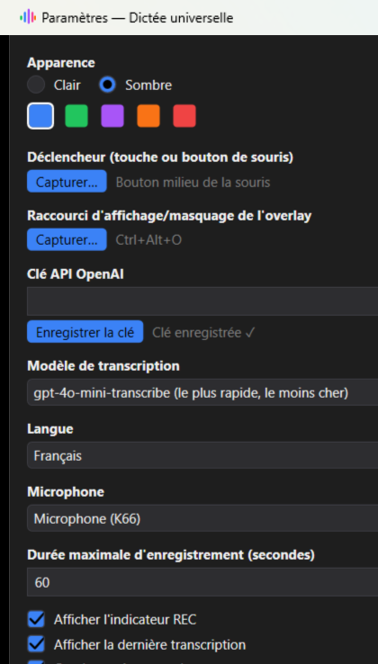

# Dictée universelle

[](LICENSE)
[](../../releases/latest)
[](../../releases/latest)

Dicte n'importe où sous Windows : un raccourci global (touche ou bouton de souris) démarre l'enregistrement depuis **n'importe quelle application**, la transcription se fait via l'API OpenAI, et le texte est **collé automatiquement** dans le champ qui avait le focus — sans extension à installer, sans changer d'outil.

<p align="center">
  
  
</p>

## Fonctionnalités

- **Déclencheur configurable** : raccourci clavier ou bouton de souris (milieu, latéral) — capturé en direct depuis les Paramètres.
- **Transcription** via l'API OpenAI (`gpt-transcribe` par défaut), catalogue de modèles éditable, langue configurable.
- **Collage universel** : le texte est copié dans le presse-papiers puis collé automatiquement dans la fenêtre qui avait le focus au début de l'enregistrement.
- **Overlay flottant** : indicateur d'enregistrement toujours visible, dernière transcription avec bouton Copier, opacité réglable, bouton pour le minimiser + raccourci dédié pour l'afficher/masquer.
- **Thème clair/sombre** avec couleur d'accent au choix, pour les fenêtres classiques (l'overlay reste un chrome minimal indépendant du thème).
- **Clé API stockée chiffrée** (DPAPI, liée au compte Windows) — jamais en clair sur le disque, jamais transmise ailleurs qu'à OpenAI.

## Installation

Télécharge le dernier installeur depuis l'onglet **[Releases](../../releases/latest)**, exécute-le (installation par utilisateur, sans droits admin requis) et lance l'application. Elle démarre réduite dans la zone de notification.

> L'installeur n'est pas signé : Windows (SmartScreen / Smart App Control) peut afficher un avertissement au premier lancement — clique sur *Informations complémentaires → Exécuter quand même*.

Ouvre ensuite **Paramètres…** depuis l'icône de la zone de notification pour renseigner ta clé API OpenAI, choisir ton déclencheur et personnaliser le reste.

## Compiler depuis les sources

Prérequis : [.NET 10 SDK](https://dotnet.microsoft.com/download), Windows 10/11.

```powershell
dotnet build src/VoiceToText/VoiceToText.csproj
dotnet run --project src/VoiceToText/VoiceToText.csproj
```

Pour construire l'installeur localement (nécessite [Inno Setup 6](https://jrsoftware.org/isinfo.php)) :

```powershell
dotnet publish src/VoiceToText/VoiceToText.csproj -c Release -r win-x64 --self-contained true -p:PublishSingleFile=true -p:IncludeNativeLibrariesForSelfExtract=true
& "C:\Program Files (x86)\Inno Setup 6\ISCC.exe" /DMyAppVersion=0.1.0 installer\VoiceToTextDictation.iss
```

Une release GitHub (installeur inclus) est aussi générée automatiquement par [`.github/workflows/release.yml`](.github/workflows/release.yml) à chaque tag `vX.Y.Z` poussé.

## Documentation

La spécification fonctionnelle complète est dans [`docs/specification-v1.md`](docs/specification-v1.md).

## Licence

[MIT](LICENSE)
