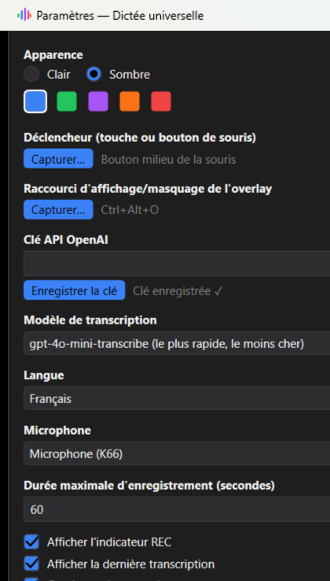

# Dictée universelle

[](LICENSE)
[](../../releases/latest)
[](../../releases/latest)

Dicte n'importe où sous Windows : un raccourci global (touche ou bouton de souris) démarre l'enregistrement depuis **n'importe quelle application**, la transcription se fait via l'API OpenAI, et le texte est **collé automatiquement** dans le champ qui avait le focus — sans extension à installer, sans changer d'outil.

<p align="center">
  
  
</p>

## Fonctionnalités

- **Déclencheur configurable** : raccourci clavier ou bouton de souris (milieu, latéral) — capturé en direct depuis les Paramètres.
- **Transcription** via l'API OpenAI (`gpt-transcribe` par défaut), catalogue de modèles éditable, langue configurable.
- **Collage universel** : le texte est copié dans le presse-papiers puis collé automatiquement dans la fenêtre qui avait le focus au début de l'enregistrement.
- **Overlay flottant** : indicateur d'enregistrement toujours visible, dernière transcription avec bouton Copier, opacité réglable, bouton pour le minimiser + raccourci dédié pour l'afficher/masquer.
- **Thème clair/sombre** avec couleur d'accent au choix, pour les fenêtres classiques (l'overlay reste un chrome minimal indépendant du thème).
- **Clé API stockée chiffrée** (DPAPI, liée au compte Windows) — jamais en clair sur le disque, jamais transmise ailleurs qu'à OpenAI.

## Installation

Télécharge le dernier installeur (`VoiceToTextDictation-win-Setup.exe`) depuis l'onglet **[Releases](../../releases/latest)**, exécute-le (installation par utilisateur, sans droits admin requis) et lance l'application. Elle démarre réduite dans la zone de notification.

> L'installeur n'est pas signé : Windows (SmartScreen / Smart App Control) peut afficher un avertissement au premier lancement — clique sur *Informations complémentaires → Exécuter quand même*.

Ouvre ensuite **Paramètres…** depuis l'icône de la zone de notification pour renseigner ta clé API OpenAI, choisir ton déclencheur et personnaliser le reste.

**Mise à jour automatique** : l'appli vérifie en tâche de fond, à chaque démarrage, si une nouvelle release est disponible sur ce dépôt GitHub, la télécharge et l'applique au redémarrage suivant (jamais pendant une dictée en cours). Aucune action manuelle nécessaire une fois installée via un des installeurs `Setup.exe` publiés depuis la version qui intègre ce mécanisme.

> Migration depuis une installation antérieure à ce mécanisme (ex. `v0.1.0`, installée via l'ancien installeur Inno Setup) : une seule réinstallation manuelle depuis le nouvel installeur `Setup.exe` est nécessaire — les mises à jour suivantes seront ensuite automatiques.

## Compiler depuis les sources

Prérequis : [.NET 10 SDK](https://dotnet.microsoft.com/download), Windows 10/11.

```powershell
dotnet build src/VoiceToText/VoiceToText.csproj
dotnet run --project src/VoiceToText/VoiceToText.csproj
```

Pour construire l'installeur localement (nécessite l'outil [Velopack](https://velopack.io) `vpk`, `dotnet tool install -g vpk`) :

```powershell
dotnet publish src/VoiceToText/VoiceToText.csproj -c Release -r win-x64 --self-contained true -o publish
vpk pack --packId VoiceToTextDictationApp --packVersion 0.2.0 --packDir publish --mainExe VoiceToText.exe --packTitle "Dictée universelle" --packAuthors MafLabs38 --icon src/VoiceToText/Assets/icon.ico --runtime win-x64 -o dist
```

Une release GitHub (installeur + paquets de mise à jour inclus) est aussi générée automatiquement par [`.github/workflows/release.yml`](.github/workflows/release.yml) à chaque tag `vX.Y.Z` poussé.

## Documentation

La spécification fonctionnelle complète est dans [`docs/specification-v1.md`](docs/specification-v1.md).

## Licence

[MIT](LICENSE)
